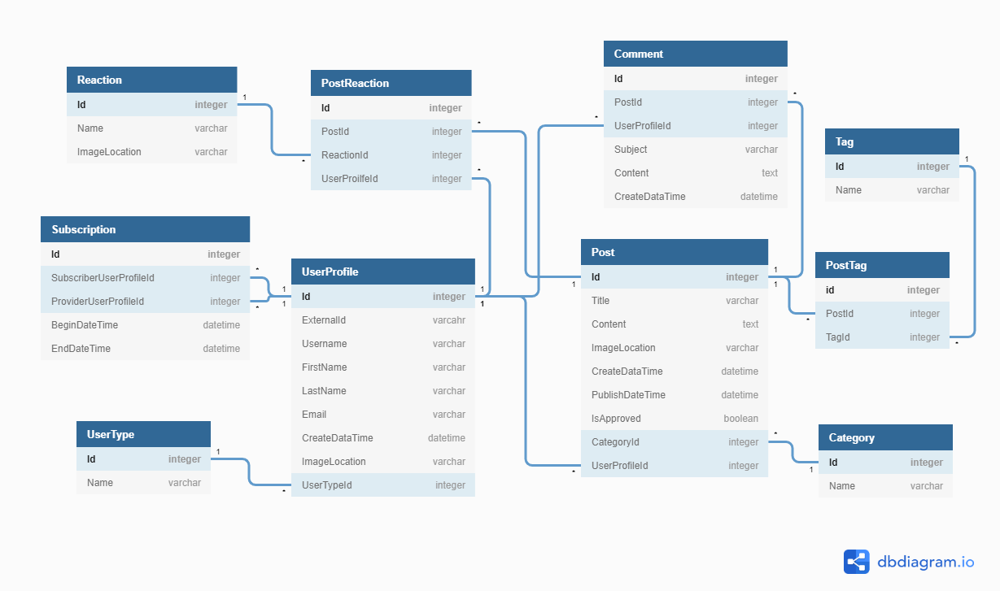

# Tabloid MVC

This is a MVC prototype of the [Tabloid CLI Proof of Concept](https://github.com/nashville-software-school/TabloidCLI) which was a console version of this application. Our focus was to conduct a single sprint and see how far into creating a the prototype we could get, but more importantly how much we could learn from taking a console application to an MVC we application.

* **Authors** can create Posts, manage their own Posts, and read and comment on other authors' posts.

* **Admins** can do all the things authors can do, but are also in charge of managing all the data in the system.

### Team

- Nicholas Douso
- Ryan DeVault
- Ron Howie
- Anna Moore

### ERD

